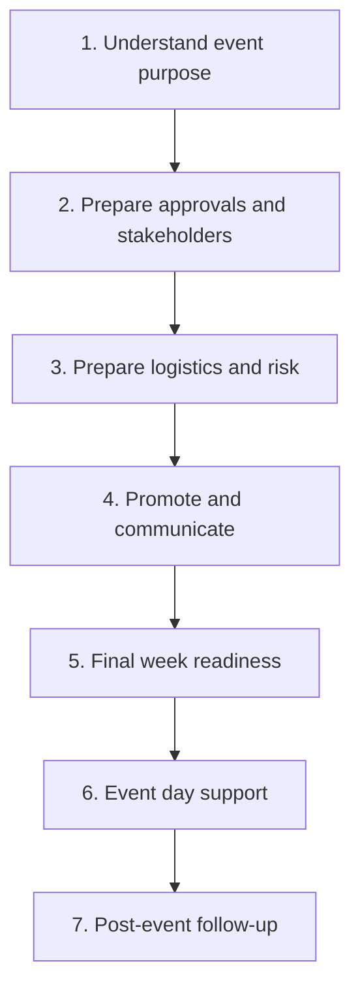
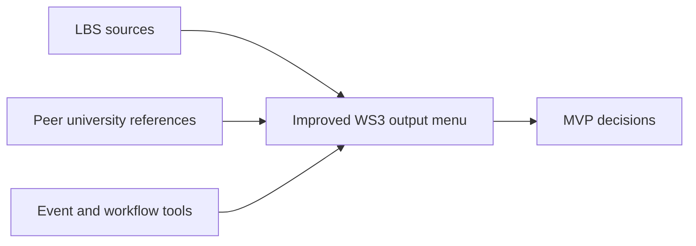

# Workstream 3 Delivery Roadmap

## One-Line Goal

Workstream 3 turns a structured event request plus routing/tiering results into useful organiser outputs: summaries, drafts, checklists, guidance, and human-review messages.

## Current Position


## Milestone Board

| Milestone | Status | Concrete Deliverable | Decision Needed |
| --- | --- | --- | --- |
| M0 Local setup | Done | App runs locally with frontend, backend, Prisma, and Postgres.app | None |
| M1 Source map | Done | `workstream-3-source-map.md`: source inventory, duplication check, WS3 relevance | None |
| M2 Activity map | Done | One visual map of organiser activities across the event lifecycle | None |
| M2.5 Benchmark scan | Done | Basic scan using only the candidate public sources already listed below | None |
| M3 Output menu | Done | Shortlist of WS3 outputs for the demo | None |
| M4 Output schema | Done | Basic `GeneratedOutputPackage` JSON shape | None |
| M5 Prompt and examples | Done | Prompt instructions plus 3 simple example generated outputs | None |
| M6 Backend endpoint | Planned | `POST /api/outputs/generate` with tests | Build after team accepts planning scope |
| M7 UI demo | Planned | Frontend display for generated outputs | Build after M6 |

## What Exists Now

The first concrete WS3 artifact is the source map:

- It confirms which source files matter.
- It identifies duplicate material.
- It keeps raw faculty/shared files out of Git.
- It says what each source contributes to WS3.
- It now includes a separate LBS event forms map covering Space Request, EIS, Speaker Security Review, Guest List, Cloakroom Booking, and Premium Space Business Case forms.

This is a foundation artifact, not a user-facing demo.

## M2 Activity Map

The M2 activity map uses only the activities already listed in this roadmap.



| Activity | What the organiser is doing | Possible WS3 outputs |
| --- | --- | --- |
| Understand event purpose | Clarify event purpose, audience, format, value, success measures, and whether the idea is ready enough to proceed. | Event readiness summary; organiser guidance; knowledge recommendations; uncertainty and missing-info messages |
| Prepare approvals and stakeholders | Identify likely LBS stakeholders, approval needs, human-review triggers, and form-readiness gaps. | Stakeholder email drafts; human-review messages; missing-info messages; crib sheet draft; readiness summary |
| Prepare logistics and risk | Work through space, catering, AV, speakers, security, guest list, cloakroom, accessibility, and operational blockers. | Timeline/checklist display; EIS-style draft; security handoff-style content; readiness summary; human-review messages |
| Promote and communicate | Prepare audience-facing and stakeholder-facing communications, including event description, call to action, channel planning, and promotion checks. | Stakeholder email drafts; promotional campaign plan; organiser guidance; knowledge recommendations |
| Final week readiness | Check whether key details, forms, stakeholders, timings, guest lists, AV, catering, and human reviews are ready. | Timeline/checklist display; missing-info messages; human-review messages; crib sheet draft; EIS-style draft |
| Event day support | Support handoff, event-day coordination, stakeholder awareness, and operational clarity. | Crib sheet draft; internal operations summary; timeline/checklist display; stakeholder email drafts |
| Post-event follow-up | Prepare follow-up communications, lessons learned, thank-you messages, and future knowledge capture. | Post-event follow-up pack; knowledge recommendations; stakeholder email drafts; organiser guidance |

## Why M2 Comes Before Building

WS3 has many possible outputs. If we jump straight to "generate everything," the prototype becomes broad and shallow.

The activity map lets us decide:

- what organisers are trying to do,
- which output helps each activity,
- which outputs are essential for the demo,
- where human review is needed,
- what Workstream 3 needs from Workstreams 1 and 4.

## M2.5 Benchmark Scan

The benchmark scan should happen after the first activity map and before the output menu. The point is to avoid copying only the current LBS process while still keeping LBS policy, tone, and operational constraints as the anchor.



### Source Types To Evaluate

| Source type | Examples to review | What to look for |
| --- | --- | --- |
| LBS internal sources | Jo transcript, event toolkit, promotion planner, Monday workflow notes | Local rules, language, risks, stakeholders, required review points |
| Peer university event guidance | LSE room/event guidance, Stanford student event planning, Princeton event toolkit, University of Exeter event toolkit, University of Minnesota student group planning | How other universities stage the process, explain approvals, and guide novice organisers |
| Event management platforms | Cvent event planning guide, Eventbrite event planning checklist | Checklist structure, event lifecycle, registration, promotion, day-of, post-event flow |
| Work management templates | monday.com event template, Asana event planning template, Airtable templates, ClickUp event management | Statuses, owners, deadlines, automations, reusable task templates, reporting |
| AI-assisted workflow patterns | Airtable AI event planning examples, ClickUp AI event workflows, general AI writing assistant patterns | Where AI helps with drafts, summaries, personalization, and repetitive coordination |

### Candidate Public Sources

Use these only for benchmarking ideas. Do not copy their text into LBS outputs.

| Source | Why evaluate it |
| --- | --- |
| [Cvent Event Planning Guide](https://www.cvent.com/en/blog/events/event-planning-guide) | Strong event lifecycle/checklist framing for professional event operations. |
| [Eventbrite Event Planning Checklist](https://www.eventbrite.com/resources/event-planning/checklist/) | Useful for simple organiser-facing checklist categories. |
| [monday.com Event Management template](https://monday.com/templates/event-planning) | Relevant because the LBS process already has Monday-style lifecycle thinking. |
| [Asana Event Planning template](https://asana.com/templates/event-planning) | Useful for sections, fields, automations, timelines, and task ownership. |
| [Asana campus event planning guide](https://help.asana.com/s/article/campus-event-planning) | Relevant student/campus planning lens. |
| [ClickUp event workflow guide](https://help.clickup.com/hc/en-us/articles/36813333788567-Run-successful-events-in-ClickUp) | Useful for repeatable event tasks, statuses, and AI/workflow automation ideas. |
| [Airtable templates guidance](https://support.airtable.com/templates) | Useful for database-style event planning and reusable template patterns. |
| [Airtable AI event planning example](https://www.airtable.com/ai-plays/event-attendee-research) | Useful for AI-assisted attendee research, invite, and follow-up patterns. |
| [LSE planning and booking events](https://info.lse.ac.uk/current-students/estates-division/facilities-guide/planning-and-booking-events) | Peer London school reference for rooms, societies, and event booking. |
| [Stanford student event planning](https://ose.stanford.edu/student-orgs/event-planning) | Peer university student organisation process reference. |
| [Princeton Event Planning Toolkit](https://planyourevent.princeton.edu/) | Example of a dedicated university event planning toolkit site. |
| [University of Exeter event planning toolkit](https://www.exeter.ac.uk/departments/communication/communications/events/toolkit/) | Good reference for planning, AV, budget, marketing, risk, GDPR, and safety groupings. |
| [University of Minnesota student group event planning](https://sua.umn.edu/event-planning) | Clear staged student-group planning model. |

### Basic Benchmark Scan

This basic scan uses only the candidate public sources already listed above.

| Listed source | Existing WS3 activity supported | Existing WS3 output supported |
| --- | --- | --- |
| Cvent Event Planning Guide | Prepare logistics and risk; final week readiness; event day support | Timeline/checklist; event readiness summary |
| Eventbrite Event Planning Checklist | Prepare logistics and risk; final week readiness | Timeline/checklist; missing-info messages |
| monday.com Event Management template | Prepare approvals and stakeholders; prepare logistics and risk; final week readiness | Timeline/checklist; stakeholder email drafts |
| Asana Event Planning template | Prepare logistics and risk; final week readiness; event day support | Timeline/checklist; event readiness summary |
| Asana campus event planning guide | Understand event purpose; prepare approvals and stakeholders; prepare logistics and risk | Organiser guidance; timeline/checklist |
| ClickUp event workflow guide | Prepare logistics and risk; final week readiness; event day support | Timeline/checklist; event readiness summary |
| Airtable templates guidance | Prepare logistics and risk; final week readiness | Timeline/checklist; event readiness summary |
| Airtable AI event planning example | Promote and communicate; post-event follow-up | Stakeholder email drafts; post-event follow-up pack |
| LSE planning and booking events | Prepare approvals and stakeholders; prepare logistics and risk | Organiser guidance; missing-info messages |
| Stanford student event planning | Understand event purpose; prepare approvals and stakeholders; prepare logistics and risk | Organiser guidance; timeline/checklist |
| Princeton Event Planning Toolkit | Understand event purpose; prepare logistics and risk; final week readiness | Organiser guidance; timeline/checklist |
| University of Exeter event planning toolkit | Prepare logistics and risk; promote and communicate; final week readiness | Timeline/checklist; organiser guidance |
| University of Minnesota student group event planning | Understand event purpose; prepare approvals and stakeholders; prepare logistics and risk | Organiser guidance; timeline/checklist |

### White Spaces To Explore

These are possible improvement areas that are not fully solved by simply digitising the current process:

| White space | Why it matters for WS3 |
| --- | --- |
| Output prioritisation | The assistant should recommend the next useful output, not generate every document every time. |
| Role-specific views | A student organiser, Jo/internal ops, Security, Editorial, and Space do not need the same wording or detail. |
| Readiness scoring by output | Each generated draft could show whether it is ready, blocked, or needs human review. |
| Evidence links | Outputs should show which event facts drove a recommendation so staff can trust the assistant. |
| Reusable event memory | Future versions should use prior lessons learned to prevent repeated venue, timing, or communication mistakes. |
| Training nudges | If an organiser repeatedly needs support, the tool could suggest training or drop-in support rather than only producing documents. |
| Copy quality checks | Generated emails and promotion copy should be checked for British English, clear CTA, correct dates, consistent venue, and audience value. |
| Escalation clarity | Human-review messages should explain who needs to review and why, without sounding like official policy if not verified. |
| Lightweight handoff | Outputs should be easy to copy into email, Monday, or an event form without reformatting. |
| Demo simplicity | The MVP should show a small number of strong outputs rather than a large set of generic drafts. |

## Suggested MVP Output Target

For the first demo, do not build every WS3 output.

M3 confirms the recommended first MVP:

| MVP output | Why it matters |
| --- | --- |
| Event readiness summary | Shows the organiser where they stand and which form/stakeholder action is likely next |
| Stakeholder email drafts | Connects directly to WS4 routing packets |
| Timeline/checklist | Gives users an actionable next-step view with form-related blockers |
| Human-review and missing-info messages | Keeps the prototype honest and safe |

M3 confirms these as later outputs:

- full crib sheet draft,
- full EIS-style draft,
- promotional campaign plan,
- post-event follow-up pack,
- knowledge recommendations from prior events.

## M4 GeneratedOutputPackage Schema

The first schema should include only the MVP outputs.

```json
{
  "event_readiness_summary": {
    "status": "string",
    "summary": "string",
    "provided_information": ["string"],
    "missing_information": ["string"],
    "likely_next_steps": ["string"]
  },
  "stakeholder_email_drafts": [
    {
      "stakeholder": "string",
      "subject": "string",
      "body": "string",
      "missing_information_to_confirm": ["string"]
    }
  ],
  "timeline_checklist": [
    {
      "phase": "string",
      "task": "string",
      "status": "string",
      "blockers": ["string"]
    }
  ],
  "human_review_messages": [
    {
      "review_area": "string",
      "reason": "string",
      "message": "string"
    }
  ],
  "missing_info_messages": [
    {
      "field_or_topic": "string",
      "why_it_matters": "string",
      "message": "string"
    }
  ]
}
```

## M5 Prompt Instructions

```text
You are generating WS3 outputs for an LBS event readiness assistant.

Use only the provided event request, tiering result, and stakeholder routing result.

Generate a GeneratedOutputPackage with only these MVP outputs:
1. event_readiness_summary
2. stakeholder_email_drafts
3. timeline_checklist
4. human_review_messages
5. missing_info_messages

Keep the language clear, practical, and non-official.
Do not invent facts.
Do not invent new stakeholders.
Do not invent approval rules.
If information is missing or uncertain, say so clearly.
If human review may be needed, explain why in plain language.
```

### Simple Example Outputs

```json
{
  "event_readiness_summary": {
    "status": "Not ready",
    "summary": "The event has a clear purpose and expected audience, but key planning information is still missing before it can be treated as ready.",
    "provided_information": ["Event name", "Expected attendees", "External speakers", "Catering required"],
    "missing_information": ["Confirmed room", "Speaker names", "Dietary requirements", "Budget code"],
    "likely_next_steps": ["Confirm space requirements", "Collect speaker details", "Check catering information", "Prepare stakeholder emails"]
  },
  "stakeholder_email_drafts": [
    {
      "stakeholder": "Space",
      "subject": "Space request information for proposed event",
      "body": "Hello, I am sharing the current information for this proposed event. The organiser expects 120 attendees and will need space suitable for a speaker session and networking. The room is not yet confirmed.",
      "missing_information_to_confirm": ["Preferred room", "Room layout", "Final attendee number"]
    }
  ],
  "timeline_checklist": [
    {
      "phase": "Needed now",
      "task": "Confirm space and room setup requirements",
      "status": "Blocked",
      "blockers": ["Preferred room is not confirmed"]
    }
  ],
  "human_review_messages": [
    {
      "review_area": "Security",
      "reason": "The event includes external speakers, but speaker details are not yet complete.",
      "message": "Security review may be needed once speaker names and topics are confirmed."
    }
  ],
  "missing_info_messages": [
    {
      "field_or_topic": "Speaker names",
      "why_it_matters": "Speaker details may affect stakeholder routing and review needs.",
      "message": "Add speaker names before treating the event package as ready."
    }
  ]
}
```

```json
{
  "event_readiness_summary": {
    "status": "Partly ready",
    "summary": "The event has enough information for early planning, but promotion and final logistics are not ready yet.",
    "provided_information": ["Event purpose", "Date", "Start time", "Expected audience"],
    "missing_information": ["Registration link", "Final agenda", "Promotion copy"],
    "likely_next_steps": ["Confirm registration link", "Prepare stakeholder email drafts", "Complete checklist items"]
  },
  "stakeholder_email_drafts": [
    {
      "stakeholder": "Editorial/Promotion",
      "subject": "Promotion information for proposed event",
      "body": "Hello, I am sharing the current event details for promotion planning. The event purpose, date, and expected audience are available, but the registration link and final copy are still missing.",
      "missing_information_to_confirm": ["Registration link", "Final event description", "Call to action"]
    }
  ],
  "timeline_checklist": [
    {
      "phase": "Needed soon",
      "task": "Confirm registration and promotion details",
      "status": "In progress",
      "blockers": ["Registration link is missing"]
    }
  ],
  "human_review_messages": [
    {
      "review_area": "Editorial/Promotion",
      "reason": "Promotion details are incomplete.",
      "message": "Promotion review may be needed once the registration link and final event description are available."
    }
  ],
  "missing_info_messages": [
    {
      "field_or_topic": "Registration link",
      "why_it_matters": "Promotion messages need a clear call to action.",
      "message": "Add the registration link before sending promotion-related drafts."
    }
  ]
}
```

```json
{
  "event_readiness_summary": {
    "status": "Early draft",
    "summary": "The event idea is captured, but more information is needed before stakeholder handoff.",
    "provided_information": ["Event idea", "Audience type"],
    "missing_information": ["Date", "Time", "Expected attendees", "Space needs", "Catering needs"],
    "likely_next_steps": ["Collect basic event details", "Identify missing planning information", "Update readiness summary"]
  },
  "stakeholder_email_drafts": [],
  "timeline_checklist": [
    {
      "phase": "Needed now",
      "task": "Complete basic event details",
      "status": "Blocked",
      "blockers": ["Date, time, attendee count, and space needs are missing"]
    }
  ],
  "human_review_messages": [],
  "missing_info_messages": [
    {
      "field_or_topic": "Basic event details",
      "why_it_matters": "Stakeholder emails and checklist actions depend on the basic event facts.",
      "message": "Add the date, time, expected attendees, and space needs before generating stakeholder drafts."
    }
  ]
}
```

## M6 Backend Endpoint Plan

```txt
POST /api/outputs/generate
```

Expected input:

```json
{
  "event_request": {},
  "tiering_result": {},
  "stakeholder_routing_result": {}
}
```

Expected output: the MVP `GeneratedOutputPackage` shape defined in M4.

Basic tests needed:

| Test | Expected result |
| --- | --- |
| Valid input returns a `GeneratedOutputPackage` | Response includes all five MVP output sections. |
| Missing event facts are surfaced | Missing details appear in `missing_information` and `missing_info_messages`. |
| Stakeholder routing creates email drafts | Stakeholders from routing result appear in `stakeholder_email_drafts`. |
| Human review flags are surfaced | Tiering/routing review needs appear in `human_review_messages`. |
| No stakeholder routing returns no email drafts | `stakeholder_email_drafts` is an empty array. |
| Invalid input is rejected | Endpoint returns a clear validation error. |
| Output stays within MVP scope | Response does not include later outputs such as full crib sheet, full EIS draft, promotional campaign plan, post-event follow-up pack, or extra product scope. |

## M7 UI Demo Plan

The UI should display only the five MVP output sections returned by `POST /api/outputs/generate`.

| UI section | Shows |
| --- | --- |
| Event readiness summary | Status, summary, provided information, missing information, and likely next steps. |
| Stakeholder email drafts | Stakeholder name, subject, body, and missing information to confirm. |
| Timeline/checklist | Phase, task, status, and blockers. |
| Human-review messages | Review area, reason, and message. |
| Missing-info messages | Field or topic, why it matters, and message. |

Basic user actions:

| Action | Purpose |
| --- | --- |
| Generate outputs | Calls `POST /api/outputs/generate`. |
| View outputs | Shows all five MVP output sections. |
| Copy email draft text | Lets the user copy a stakeholder email draft. |
| Review missing information | Lets the user see which details are incomplete. |
| Review human-review messages | Lets the user see where human review may be needed. |

Basic UI flow:

```text
Event request available
↓
User selects Generate outputs
↓
Frontend calls POST /api/outputs/generate
↓
GeneratedOutputPackage is returned
↓
UI displays the five MVP sections
↓
User reviews the event readiness summary, missing information, human-review messages, checklist, and stakeholder email drafts
```

## Definition Of Done For M2

M2 is done when we have:

- a visual event activity map,
- each activity linked to possible WS3 outputs,
- one recommended MVP subset,
- open questions for the team,
- no implementation decisions made prematurely.

## Current Status

WS3 planning is complete at a basic roadmap level from M2 through M7. The next work is implementation, starting with the M6 backend endpoint and then the M7 UI display.
