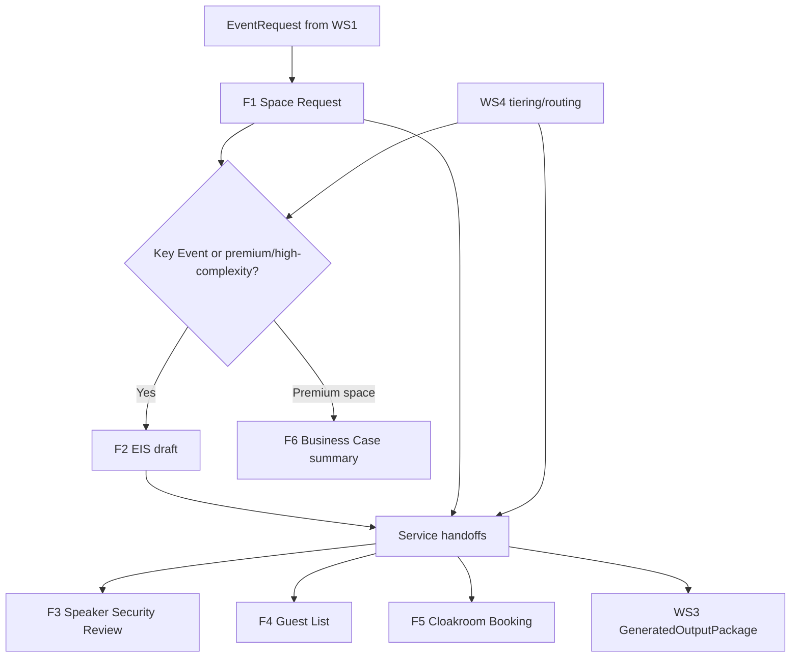

# Workstream 3 LBS Event Forms Map

## Status

Layer 1 expansion for Workstream 3. This document maps the LBS event forms provided locally. It is a synthesis only; the raw forms remain outside Git.

Do not commit the original Word, Excel, or PDF forms unless the team explicitly approves it. Use this map to understand what each form collects and how Workstream 3 can generate better drafts, checklists, and handoff outputs.

## Form Inventory

| ID | Form | Type | Main purpose | WS3 relevance |
| --- | --- | --- | --- | --- |
| F1 | Space Request Form | DOCX | Initial request for event space and key-event assessment | Drives readiness summary, missing fields, space/logistics checklist |
| F2 | Event Information Sheet (EIS) | DOCX | Collaborative planning document for Key Events | Drives EIS-style draft and service-specific handoff summaries |
| F3 | Speaker Security Review Form | XLSX | Speaker review input for Security | Drives security handoff and human-review messages |
| F4 | Guest List Form | XLSX | Guest list input for Security / Welcome Desk | Drives guest-list readiness and final-check reminders |
| F5 | Cloakroom Booking Form | DOCX | Cloakroom request details | Drives operational checklist items when cloakroom is needed |
| F6 | Premium Space Event Student Business Case | PDF | Business case for premium event space | Drives strategic summary, audience impact, and review prompts |

## Form Flow

## Field Groups By Form

| Form | Main field groups |
| --- | --- |
| F1 Space Request | organiser details, event fundamentals, audience, date/timing, event purpose/format, external speakers, sensitivity/controversy, venue type, room setup, additional spaces, registration, decorations, catering/alcohol, AV, noise/disruption, hired equipment, filming/streaming, timing/compliance, approval declaration, office assessment |
| F2 EIS | organiser details, event logistics/audience, timeline, catering, dietary requirements, alcohol, AV, technical rehearsal, security, external speakers/VIPs, welcome desk, badge printing, cloakroom, estates/porters, communications/promotion, service times, room booking, success metrics, follow-up activities, completion checklist, events oversight comments |
| F3 Speaker Security Review | organiser details, event ID/name/date, speaker name, job title, company, social media accounts, alumni marker, presentation topic, controversy marker, attention/security concern marker |
| F4 Guest List | organiser details, event ID/name/date, guest name, guest type, email, organisation/affiliation, special access requirements, notes |
| F5 Cloakroom Booking | programme/event name, day/date, start/finish time, purpose, expected quantity, cloakroom preference, attendant booking, reception confirmation |
| F6 Premium Space Business Case | event title/date, organising club, strategic owner, project manager, purpose, planned content, primary audience, strategic alignment, audience think/feel/do impact, project deadlines, promotion start, prior performance, success measures, risks/dependencies/sensitivities/opportunities, attached documents |

## What This Means For Workstream 3

The forms show that WS3 should not only generate prose. It should generate **form-ready outputs** that help organisers complete required LBS documents.

Recommended WS3 output categories:

| Output category | Form support | What WS3 can generate |
| --- | --- | --- |
| Event readiness summary | F1, F2, F6 | A short summary of event status, missing information, and likely review needs |
| EIS-style draft | F2 | A structured draft organised around service teams and event timeline |
| Space/logistics checklist | F1, F2, F5 | Required actions for space, setup, catering, AV, welcome desk, cloakroom, and timing |
| Security handoff | F1, F2, F3, F4 | A concise summary of speakers, VIPs, guest list readiness, access concerns, and review blockers |
| Premium-space business case summary | F6 | Strategic rationale, audience impact, success measures, and risks/dependencies |
| Stakeholder email drafts | F1-F6 plus WS4 packets | Emails tailored to Space, Security, Catering, AV, Editorial/Promotion, Welcome Desk, Estates/Porters, or organiser follow-up |
| Human-review messages | F1-F6 plus WS4 tiering | Clear warnings where LBS staff review is required or where information is too uncertain |

## Concrete White Spaces Revealed

| White space | Observation from forms | WS3 opportunity |
| --- | --- | --- |
| Same facts repeated across forms | Organiser, event ID/title/date, attendance, audience, speaker, and timing fields appear repeatedly | Generate reusable form-ready snippets from one event object |
| Key Event logic is hard for students | Space Request and EIS imply a handoff once an event is designated as a Key Event | Show "why this may be Key Event / what changes next" in plain language |
| Security inputs are split | Security depends on speaker review and guest-list details, not just one event summary | Generate a security readiness checklist and separate speaker/guest blockers |
| Promotion and business case overlap | Premium-space business case asks for purpose, audience impact, content, success measures, and promotion timing | Reuse the same strategic narrative across business case, promotion plan, and stakeholder emails |
| Operational forms are not user-centric | Forms are service-oriented and distributed across several files | Provide a single organiser view: what is ready, what is missing, which form/output is next |
| Human review needs clearer explanation | Several forms imply approval, review, or provisional status | WS3 should explain review triggers without presenting prototype guidance as official policy |

## Suggested WS3 MVP Adjustment

The first WS3 MVP should stay small, but it should now be framed around form readiness:

1. **Event readiness summary**
   - What the organiser has provided.
   - What is missing.
   - Which forms or stakeholders are likely next.

2. **Stakeholder email drafts**
   - Generated from WS4 routing packets.
   - Include only the facts the recipient needs.

3. **Timeline/checklist**
   - Include form-related deadlines and blockers.
   - Separate "needed now" from "needed later".

4. **Human-review and missing-info messages**
   - Flag likely Security, Editorial, Key Event, premium-space, or senior-review needs.

Do not build full automated form filling yet. That is a later opportunity after the schema and review rules are stable.

## Open Questions

- Should WS3 generate a full EIS-style draft in the first demo, or only an EIS readiness summary?
- Which form is the best demo anchor: Space Request, EIS, or Premium Space Business Case?
- Should the UI show outputs by activity stage, by form, or by stakeholder?
- Which form deadlines are mandatory versus guidance?
- Which contact/team names can safely appear in generated demo output?
- Should generated outputs include copy-ready text only, or also structured JSON for later form filling?
